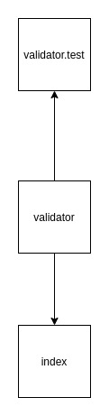

# LAB - 01

## Node Ecosystem

### Author: Travis Skyles

### Links and Resources

- [submission PR](https://github.com/tskyles-401-advanced-javascript/401-lab-01/pull/1/)
- [travis](https://travis-ci.com/tskyles-401-advanced-javascript/401-lab-01/builds/144670547)

#### Documentation

- JSDoc 
- run files in /docs folder to view documentation

### Setup

npm init -y
npm install jest
npm install faker
npm start to run index

#### Tests

use 'npm test' to run test suite

#### UML

